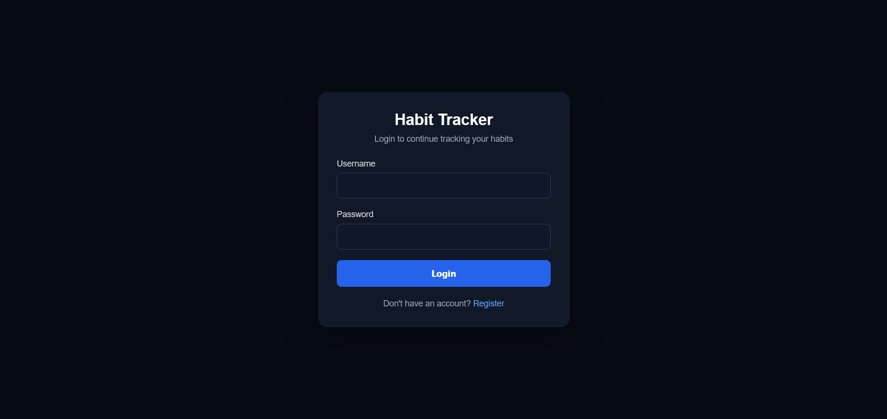
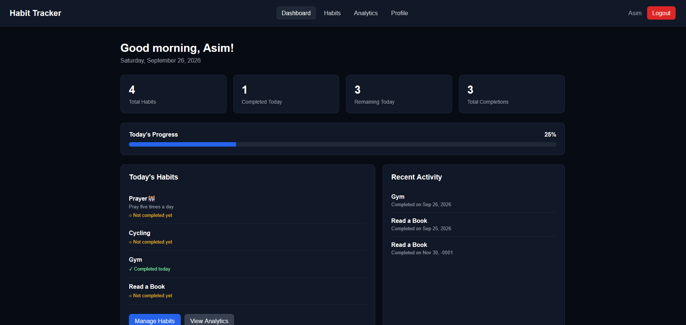
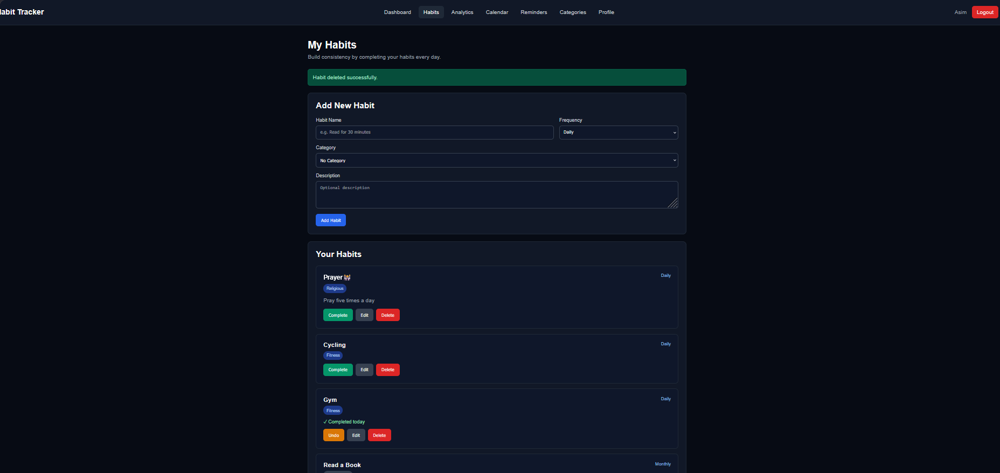
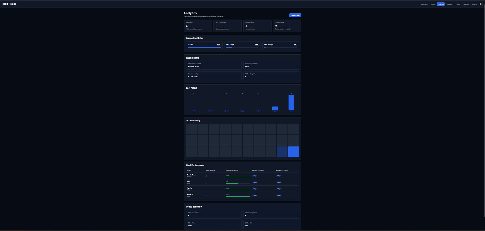
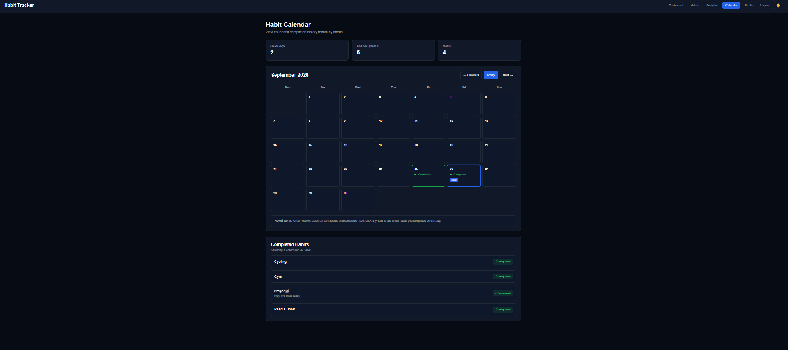

# Habit Tracker — PHP & MySQL

A web-based Habit Tracker built with **PHP, MySQL, HTML, CSS, and JavaScript**. The application allows users to create and manage personal habits, track daily completion, organize habits into categories, view progress analytics, manage reminders, and export their data.

## Features

* User registration and login
* Secure password hashing
* Case-sensitive usernames
* Session-based authentication
* CSRF protection
* Prepared SQL statements
* User-specific data isolation
* Create, edit, complete, undo, and delete habits
* Habit categories
* Habit frequency settings
* Reminder times
* Browser-based habit reminders
* Dashboard with habit statistics
* Analytics and progress tracking
* Calendar view
* User profile
* Feedback system
* CSV data export
* Secure logout
* Database foreign keys and cascading relationships

## Technologies Used

* **PHP** — Backend development
* **MySQL** — Database
* **HTML5** — Page structure
* **CSS3** — Styling and responsive UI
* **JavaScript** — Interactive features and browser reminders
* **XAMPP** — Local Apache and MySQL environment
* **Git & GitHub** — Version control and project hosting

## Project Structure

```text
habit-tracker-php-mysql/
│
├── index.php
├── login.php
├── register.php
├── logout.php
│
├── dashboard.php
├── habits.php
├── categories.php
├── analytics.php
├── calendar.php
├── reminders.php
├── profile.php
├── feedback.php
├── export.php
│
├── db.example.php
├── .gitignore
└── README.md
```

## Database

The application uses a MySQL database named:

```text
habit_tracker_db
```

Main database tables include:

### `users`

Stores registered user accounts.

```text
id
username
email
password
created_at
```

### `habits`

Stores user habits and their settings.

```text
id
user_id
category_id
habit_name
description
frequency
reminder_time
created_at
```

### `categories`

Stores user-specific habit categories.

```text
id
user_id
name
created_at
```

### `habit_completions`

Stores the dates on which habits were completed.

```text
id
habit_id
completed_date
created_at
```

The database uses **foreign keys** and cascading rules to maintain relationships between users, habits, categories, and completions.

## Security

Security was considered throughout the application.

The project includes:

* Password hashing using PHP's `password_hash()`
* Password verification using `password_verify()`
* Prepared statements to reduce SQL injection risks
* CSRF tokens for form submissions
* Session-based authentication
* Session ID regeneration after successful login
* User ownership checks
* User-specific database queries
* Secure session cookie settings
* Generic authentication error messages
* Local database configuration excluded from Git

The actual `db.php` configuration file is intentionally excluded from the repository using `.gitignore`.

A safe example configuration is provided in:

```text
db.example.php
```

## Installation

### 1. Install XAMPP

Install XAMPP with:

* Apache
* MySQL

### 2. Clone the repository

```bash
git clone https://github.com/5665siddiqueasim679-source/habit-tracker-php-mysql.git
```

Move the project into your XAMPP `htdocs` directory.

Example:

```text
C:\xampp\htdocs\habit-tracker-php-mysql
```

### 3. Create the database

Open **phpMyAdmin** and create:

```text
habit_tracker_db
```

Then create the required tables:

```text
users
habits
categories
habit_completions
```

### 4. Configure the database

Create a local `db.php` file based on:

```text
db.example.php
```

For a default local XAMPP installation, the configuration may look like:

```php
<?php

$host = "localhost";
$username = "root";
$password = "";
$database = "habit_tracker_db";

$conn = new mysqli($host, $username, $password, $database);

if ($conn->connect_error) {
    die("Database connection failed: " . $conn->connect_error);
}

?>
```

**Do not upload your real `db.php` to GitHub.**

### 5. Start XAMPP

Start:

```text
Apache
MySQL
```

### 6. Open the application

Visit:

```text
http://localhost/habit-tracker-php-mysql/
```

Register an account and start creating habits.

## Application Workflow

```text
Register
   ↓
Login
   ↓
Dashboard
   ↓
Create Categories
   ↓
Create Habits
   ↓
Complete Habits
   ↓
Track Progress
   ↓
Analytics / Calendar
   ↓
Reminders / Export
```

```markdown
## Screenshots

### Login

[](screenshots/login.png)

### Dashboard

[](screenshots/dashboard.png)

### Habits

[](screenshots/habits.png)

### Analytics

[](screenshots/analytics.png)

### Calendar

[](screenshots/calendar.png)

## Future Improvements

Possible future improvements include:

* Mobile-responsive improvements
* Streak tracking
* Weekly and monthly reports
* More advanced charts
* Email reminders
* Password reset functionality
* Dark/light theme switching
* REST API integration
* Deployment to a production server
* Automated testing
* Docker support

## Learning Goals

This project was developed as a practical software engineering project to strengthen skills in:

* PHP backend development
* MySQL database design
* CRUD operations
* Authentication
* Session management
* SQL relationships
* Database security
* Frontend/backend integration
* Git and GitHub
* Web application security

## Author

**Asim Siddique**

BS Software Engineering Student

GitHub:

https://github.com/5665siddiqueasim679-source

## License

This project is licensed under the **MIT License**.

See the [LICENSE](LICENSE) file for the full license text.
